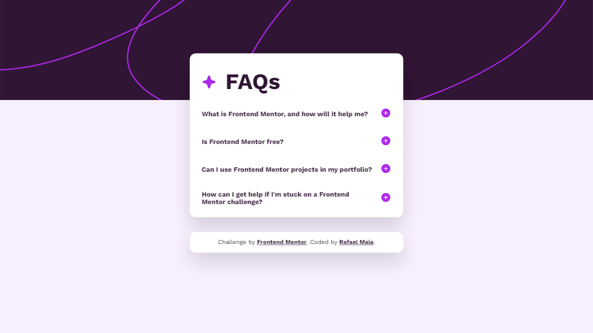

# Frontend Mentor - FAQ accordion solution

This is a solution to the [FAQ accordion challenge on Frontend Mentor](https://www.frontendmentor.io/challenges/faq-accordion-wyfFdeBwBz). Frontend Mentor challenges help you improve your coding skills by building realistic projects.

## Table of contents

- [Overview](#overview)
  - [The challenge](#the-challenge)
  - [Screenshot](#screenshot)
  - [Links](#links)
- [My process](#my-process)
  - [Built with](#built-with)
- [Author](#author)
- [Donate](#donate)

## Overview

### The challenge

Users should be able to:

- Hide/Show the answer to a question when the question is clicked
- Navigate the questions and hide/show answers using keyboard navigation alone
- View the optimal layout for the interface depending on their device's screen size
- See hover and focus states for all interactive elements on the page

### Screenshot

### Links

- Solution URL: [https://github.com/rafaeldevvv/frontend-mentor-faq-accordion](https://github.com/rafaeldevvv/frontend-mentor-faq-accordion)
- Live Site URL: [https://rafaeldevvv.github.io/frontend-mentor-faq-accordion/](https://rafaeldevvv.github.io/frontend-mentor-faq-accordion/)

## My process

### Built with

- HTML
- [TailwindCSS](https://tailwindcss.com)

## Author

The name's Rafael Maia. You can find me on [Instagram](https://www.instagram.com/rafaeldevvv), [X](https://www.twitter.com/rafaeldevvv), and [Linkedin](https://www.linkedin.com/in/rafael-maia-b69662263). Or you can send me an email [rafaeldeveloperr@gmail.com](mailto:rafaeldeveloperr@gmail.com).

I am a freelancer, so you can also find me on [Fiverr](https://www.fiverr.com/rafael787) and [Upwork](https://www.upwork.com/freelancers/~01a4dc9692c96839dc).

## Donate

Also, if you liked this project, consider [buying me a coffee](https://www.buymeacoffee.com/rafael.maia) ☕.
